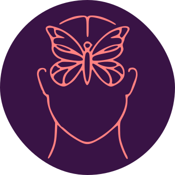

  

<h2 align="center">Giovana Mondek: Psicoterapia Cognitivo Comportamental</h2>

<h3 align="center">Landing page responsiva e minimalista que apresenta os serviços oferecidos pela psicóloga Giovana Mondek</h3>

Esse projeto foi desenvolvido voluntariamente em colaboração com Giovana, que definiu o conteúdo a ser exibido na página e a identidade visual.

  

## Identificação de requisitos

* Foi realizada uma reunião inicial com a psicóloga para definir quais informações ela gostaria de apresentar na página.

## Design da interface

* Apresentei os wireframes com a estrutura básica do layout da página para Giovana, que aprovou o layout apresentado.
* A identidade visual já foi previamente definida por Giovana, de forma que as cores e logotipo utilizados na landing page respeitaram as suas preferências.

## Funcionalidades

* Exibir informações sobre os serviços psicológicos oferecidos por Giovana;
* Exibir um modal com mais informações sobre cada modalidade de tratamento ao clicar em um botão;
* Botões "Call-to-Action" que direcionam para o contato com a psicóloga;
* Responsividade em dispositivos com diferentes tamanhos de tela.
  

https://github.com/user-attachments/assets/92263e08-1975-481b-860b-225eeaee3c11

## Tecnologias 
* HTML5
* CSS3
* Bootstrap
* Figma

## Acesso ao projeto

A hospedagem da landing page foi feita na plataforma Vercel. O site pode ser acessado <a href="https://psigiovanamondek.vercel.app/" target="_blank">neste link</a>.

Desenvolvido por Isabela Borges

